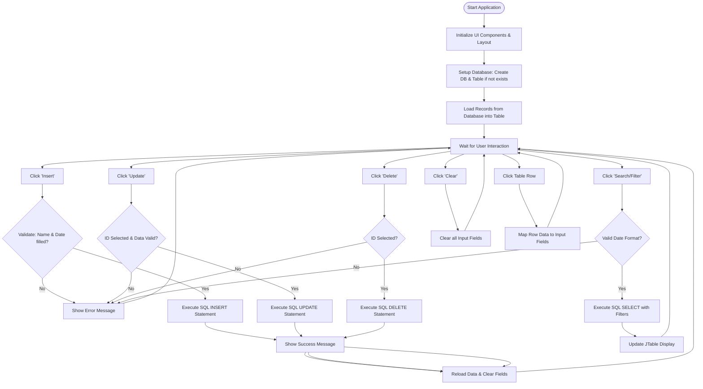

# Student Attendance Monitoring System

A Java-based desktop application for managing student attendance records using a MySQL database.

## Features
- **Centralized Title:** Large, centered "Student Attendance Monitoring System" header.
- **Modern Layout:** Optimized 0.8cm (30px) margins for a clean, professional look.
- **CRUD Operations:**
    - **Insert:** Add new attendance records.
    - **Update:** Modify existing records by selecting them from the table.
    - **Delete:** Remove records from the database.
    - **Clear:** Reset input fields quickly.
- **Search & Filter:** Search students by name or status, and filter the list by specific dates.
- **Real-time Synchronization:** The table automatically refreshes after every database operation.

## Requirements
- **Java Development Kit (JDK):** Version 8 or higher.
- **MySQL Server:** Must be running with the credentials specified in the code.
- **MySQL Connector/J:** Required for database connectivity.

## Logic Flowchart

## Setup Instructions
1. Ensure MySQL is running on `localhost:3306`.
2. Update the `USER` and `PASS` constants in `CRUD_GUI.java` if your MySQL credentials differ.
3. Compile and run `CRUD_GUI.java`. The database `crud_gui_db` and table `attendance_records` will be created automatically.
